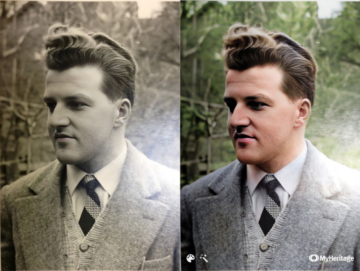

# Colorization

Colorization is the process of adding plausible color information to monochrome photographs:

The image inputs are photos of my grandfather, Willy Burri. He had passed away when my mother was around 12 years old.
  
## Portrait

<ImageSliderGithub :key="componentKey" inputImageURL='https://raw.githubusercontent.com/Phhofm/upscale/main/sources/colorization/input/portrait.webp' relativePathOutputFolder='colorization/portrait'/>

<button v-if="fullscreenEnabled" @click="enterFullscreen('portraitExample')" style="color:mediumseagreen;"><strong>FULLSCREEN (Exit with ESC)</strong></button> 
<button v-if="fullscreenEnabled" @click="forceRerender()" style="color:mediumseagreen;"><strong>Reset examples</strong></button>  
 

  
Details

  

Input Image: [Image](https://github.com/Phhofm/upscale/blob/main/sources/colorization/input/portrait.webp)

Output Images: [Github Folder](https://github.com/Phhofm/upscale/tree/main/sources/colorization/portrait)

  

## Couple

<ImageSliderGithub :key="componentKey" inputImageURL='https://raw.githubusercontent.com/Phhofm/upscale/main/sources/colorization/input/couple.webp' relativePathOutputFolder='colorization/couple'/>

<button v-if="fullscreenEnabled" @click="enterFullscreen('coupleExample')" style="color:mediumseagreen;"><strong>FULLSCREEN (Exit with ESC)</strong></button> 
<button v-if="fullscreenEnabled" @click="forceRerender()" style="color:mediumseagreen;"><strong>Reset examples</strong></button>  
 

  
Details

  

Input Image: [Image](https://github.com/Phhofm/upscale/blob/main/sources/colorization/input/couple.webp)

Output Images: [Github Folder](https://github.com/Phhofm/upscale/tree/main/sources/colorization/couple)

  

