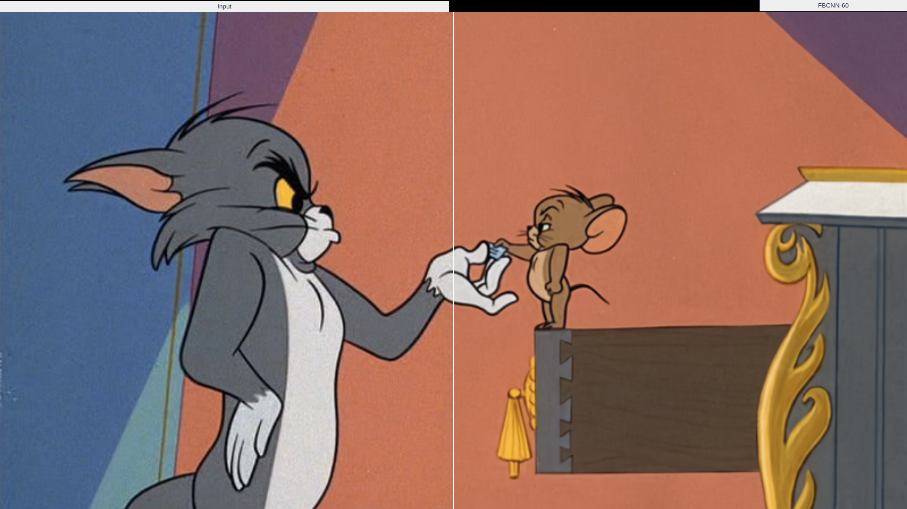

# Interpolated Models

With chaiNNer we can create 'new models' by interpolating (combining the model weights of) two models that share a pretrained model ancestor as illustrated in the image below. I tried out combinations and are providing some the outputs and models here. Since a lot of these interpolated models seem to introduce a slight color shift, I used the average color fix on these outputs.

You can download these interpolated models:
4xInt-Ultracri (UltraSharp + Remacri)
4xInt-Superscri (Superscale + Remacri)
4xInt-Siacri (Siax + Remacri)
4xInt-RemDF2K (Remacri + RealSR_DF2K_JPEG)
4xInt-RemArt (Remacri + VolArt)
4xInt-RemAnime (Remacri + AnimeSharp)
4xInt-RemacRestore (Remacri + UltraMix_Restore)
4xInt-AnimeArt (AnimeSharp + VolArt)

The combinations I had tried out so far:
Remacri + BSRGAN = RemacRGAN
Siax + Remacri = Siacri
Superscale + Remacri = Superscri
RealisticRescaler + Remacri = RealisticRemacri
UltraSharp + Remacri = Ultracri
RealisticRescaler + UltraSharp = RealisticSharp
Remacri + VolArt = RemArt
Remacri + AnimeSharp = RemAnime
AnimeSharp + VolArt = AnimeArt
RealisticRescaler + UltraMix_Restore = RealisticRestore
Remacri + RealSR_DF2K_JPEG = RemDF2K
RealisticRescaler + VolArt = RealisticArt
Struzan + Deviance = Struzance
Remacri + UltraMix_Restore = RemacRestore
BSRGAN + UltraMix_Restore = BSRestore
BSRGAN + RealisticRescaler = BSRescaler
Siax + BSRGAN = SiAN
  
## Tom And Jerry

<ImageSliderGithub :key="componentKey" inputImageURL='https://raw.githubusercontent.com/Phhofm/upscale/main/sources/output/lossless/artifactsremoval/tomandjerry/input.jpeg' relativePathOutputFolder='output/lossless/artifactsremoval/tomandjerry'/>

<button v-if="fullscreenEnabled" @click="enterFullscreen('tomandjerryExample')" style="color:mediumseagreen;"><strong>FULLSCREEN (Exit with ESC)</strong></button> 
<button v-if="fullscreenEnabled" @click="forceRerender()" style="color:mediumseagreen;"><strong>Reset examples</strong></button>  
 

  
Details

  

Input Image: [Image](https://github.com/Phhofm/upscale/blob/main/sources/output/lossless/artifactsremoval/tomandjerry/input.jpeg)

Output Images: [Github Folder](https://github.com/Phhofm/upscale/tree/main/sources/output/lossless/artifactsremoval/tomandjerry)

  

## Gate 2

<ImageSliderGithub :key="componentKey" inputImageURL='https://raw.githubusercontent.com/Phhofm/upscale/main/sources/output/lossless/artifactsremoval/gate2/input.jpeg' relativePathOutputFolder='output/lossless/artifactsremoval/gate2'/>

<button v-if="fullscreenEnabled" @click="enterFullscreen('tomandjerryExample')" style="color:mediumseagreen;"><strong>FULLSCREEN (Exit with ESC)</strong></button> 
<button v-if="fullscreenEnabled" @click="forceRerender()" style="color:mediumseagreen;"><strong>Reset examples</strong></button>  
 

  
Details

  

Input Image: [Image](https://github.com/Phhofm/upscale/blob/main/sources/output/lossless/artifactsremoval/gate2/input.jpeg)

Output Images: [Github Folder](https://github.com/Phhofm/upscale/tree/main/sources/output/lossless/artifactsremoval/gate2)

  

